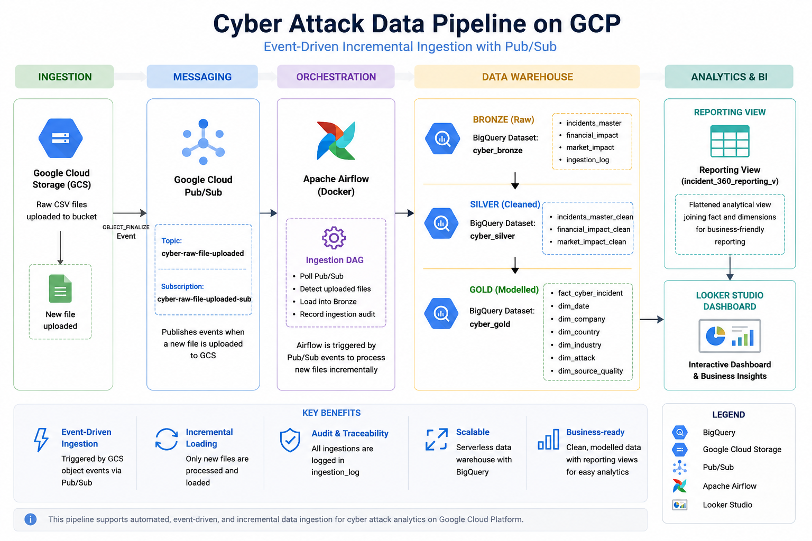

# Cyber Attack Data Pipeline  
**GCP · Airflow · BigQuery · Looker Studio**

An end-to-end data engineering project that transforms raw cyber attack data into structured, analytics-ready datasets for business insights.

---

## Overview

This project builds an end-to-end data pipeline on Google Cloud Platform (GCP) to analyse global cyber attack incidents and their:

- Financial impact  
- Operational disruption  
- Market reaction  

**Pipeline Flow**

Raw CSV → GCS → Pub/Sub → Airflow → BigQuery (Bronze → Silver → Gold) → Reporting View → Looker Studio
---

## Architecture

  

---

## Project Features

- Event-driven incremental ingestion with Pub/Sub
- Multi-layer lakehouse architecture
- Star schema dimensional modelling
- Automated workflow orchestration using Airflow
- Incremental loading into Bronze tables
- Ingestion audit logging
- BI reporting view
- Interactive Looker Studio dashboard

---

## Objectives

- Design a production-style data pipeline using GCP and Airflow
- Implement a multi-layer architecture (Bronze / Silver / Gold)
- Build a dimensional data model (star schema)
- Enable business analysis through a reporting layer
- Implement event-driven incremental ingestion using Google Cloud Pub/Sub

---

## Tech Stack

| Layer            | Technology                          |
|-----------------|-------------------------------------|
| Cloud           | Google Cloud Storage                |
| Messaging       | Google Cloud Pub/Sub                |
| Orchestration   | Apache Airflow (Docker)             |
| Data Warehouse  | BigQuery                            |
| Processing      | SQL                                 |
| Visualization   | Looker Studio                       |
| Version Control | Git + Github                        |

---

## Data Sources

Three datasets are ingested from GCS:

- `incidents_master_02.csv`
- `financial_impact_02.csv`
- `market_impact_02.csv`

---

## Data Architecture

### Bronze Layer — Raw Ingestion

Dataset: `cyber_bronze`

- incidents_master
- financial_impact
- market_impact

Raw data is loaded with minimal transformation.

---

## Incremental Data Ingestion

The pipeline supports event-driven incremental ingestion using Google Cloud Pub/Sub.

**Workflow**

1. A new CSV file is uploaded to Google Cloud Storage.
2. GCS publishes an `OBJECT_FINALIZE` event to Pub/Sub.
3. Airflow polls the Pub/Sub subscription every minute.
4. The uploaded file is automatically loaded into the appropriate Bronze table.
5. Each ingestion is recorded in the audit log (`cyber_bronze.ingestion_log`), which contains:

- Source file name
- Target table
- Rows loaded
- Ingestion status
- Execution metadata

---

### Silver Layer — Cleaning & Standardisation

Dataset: `cyber_silver`

- incidents_master_clean
- financial_impact_clean
- market_impact_clean

**Key Transformations**

- Data type casting
- Date standardisation
- String standardisation (`LOWER`, `TRIM`)
- Data quality checks
- Derived metrics

---

### Gold Layer — Data Warehouse

Dataset: `cyber_gold`

#### Star Schema

  

---

#### Fact Table

`fact_cyber_incident`

- Grain: **1 row = 1 incident**

Includes:

- Financial metrics
- Breach metrics
- Market reaction metrics
- Derived KPIs

---

#### Dimension Tables

- dim_date
- dim_company
- dim_country
- dim_industry
- dim_attack
- dim_source_quality

---

## Reporting Layer

**View:** `incident_360_reporting_v`

A flattened analytical dataset that:

- Joins fact and dimension tables
- Provides business-friendly attributes
- Consolidates all KPIs into a single table

Used directly in Looker Studio dashboards.

---

## BI Layer (Looker Studio — In Progress)

An executive dashboard has been developed in Looker Studio using the reporting view:

`cyber_gold.incident_360_reporting_v`

The dashboard supports interactive analysis of cyber attack incidents through:

- KPI overview: total incidents, total financial loss, average loss, and average downtime
- Industry-level comparisons
- Severity analysis
- Time-based incident trends
- Interactive filters for industry, country, attack type, and date

---

### Dashboard Preview

  

---

## Data Modelling Strategy

Bronze: Raw ingestion  
Silver: Clean & standardise  
Gold: Star schema  
Reporting: BI-friendly view

---

## Key Metrics

**Time Metrics**
- days_to_discovery
- days_to_disclosure

**Financial Impact**
- total_loss_usd
- recovery_cost_usd
- legal_fees_usd

**Market Reaction**
- abnormal_return_1d / 7d / 30d
- days_to_price_recovery

**Incident Characteristics**
- is_data_breach
- is_ransom_case
- is_operational_disruption

---

## Analytical Capabilities

**Financial Analysis**
- Identify industries with the highest financial losses
- Compare the impact on public and private companies

**Detection & Disclosure**
- Analyse breach detection timelines
- Evaluate disclosure delays

**Market Impact**
- Measure stock price reactions
- Compare short-term and long-term effects

---

## Best Practices

- Sensitive files excluded via `.gitignore`
- Modular and reusable pipeline design
- Clear separation of ingestion, transformation, and modelling
- Event-driven incremental ingestion using Pub/Sub
- Ingestion audit logging for traceability

---

## Future Improvements

- Develop an advanced Power BI dashboard with richer analytics and interactive storytelling
- Expand the analytical dashboard with additional KPIs and visualisations
- Build executive and operational dashboards tailored to different business users
  
---

## Author

Linda Vo  
Data Engineering | Data Analytics | Data Science
