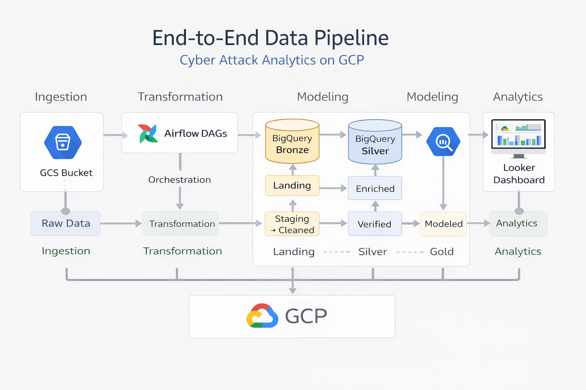
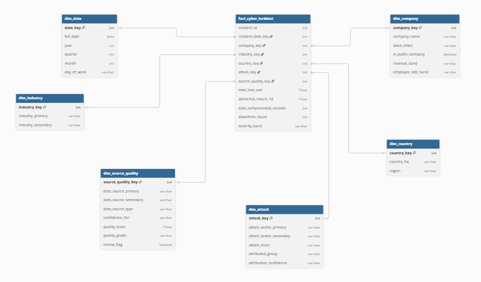
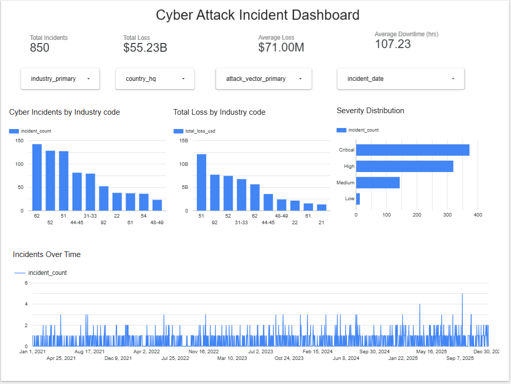

# Cyber Attack Data Pipeline  
**GCP · Airflow · BigQuery · Looker Studio**

An end-to-end data engineering project transforming raw cyber attack data into structured, analytics-ready datasets for business insights.

---

## Overview

This project builds a full data pipeline on Google Cloud Platform to analyze global cyber attack incidents and their:

- Financial impact  
- Operational disruption  
- Market reaction  

**Pipeline Flow**

Raw CSV → GCS → Airflow → BigQuery (Bronze → Silver → Gold) → Looker Studio
---

## Architecture

  

---

## Objectives

- Design a production-style data pipeline using GCP and Airflow  
- Implement a multi-layer architecture (Bronze / Silver / Gold)  
- Build a dimensional data model (star schema)  
- Enable business analysis through a reporting layer  

---

## Tech Stack

| Layer            | Technology                          |
|-----------------|-------------------------------------|
| Cloud           | Google Cloud Platform (GCS, BigQuery) |
| Orchestration   | Apache Airflow (Docker)             |
| Processing      | SQL (BigQuery)                      |
| Visualization   | Looker Studio                       |
| Version Control | GitHub                              |

---

## Data Sources

Three datasets ingested from GCS:

- `incidents_master_02.csv`  
- `financial_impact_02.csv`  
- `market_impact_02.csv`  

---

## Data Architecture

### Bronze Layer — Raw Ingestion

Dataset: `cyber_bronze`

- incidents_master  
- financial_impact  
- market_impact  

Raw data is loaded with minimal transformation.

---

### Silver Layer — Cleaning & Standardization

Dataset: `cyber_silver`

- incidents_master_clean  
- financial_impact_clean  
- market_impact_clean  

**Key Transformations**

- Data type casting  
- Date normalization  
- String standardization (LOWER, TRIM)  
- Data quality checks  
- Derived metrics  

---

### Gold Layer — Data Warehouse

Dataset: `cyber_gold`

#### Star Schema

  

---

#### Fact Table

`fact_cyber_incident`

- Grain: **1 row = 1 incident**

Includes:

- Financial metrics  
- Breach metrics  
- Market reaction metrics  
- Derived KPIs  

---

#### Dimension Tables

- dim_date  
- dim_company  
- dim_country  
- dim_industry  
- dim_attack  
- dim_source_quality  

---

## Reporting Layer

**View:** `incident_360_reporting_v`

A flattened analytical dataset that:

- Joins fact and dimension tables  
- Provides business-friendly attributes  
- Consolidates all KPIs in one table  

Used directly in Looker Studio dashboards.

---

## BI Layer (Looker Studio — in progress)

An executive dashboard was built in Looker Studio using the reporting view:

`cyber_gold.incident_360_reporting_v`

The dashboard supports interactive analysis of cyber attack incidents through:

- KPI overview: total incidents, total financial loss, average loss, average downtime  
- Industry-level comparisons  
- Severity distribution analysis  
- Time-based incident trends  
- Interactive filters for industry, country, attack type, and date  

### Dashboard Preview

  

---

## Data Modeling Strategy

Bronze: Raw ingestion
Silver: Clean & standardize
Gold: Star schema
Reporting: BI-friendly view

---

## Key Metrics

**Time Metrics**
- days_to_discovery  
- days_to_disclosure  

**Financial Impact**
- total_loss_usd  
- recovery_cost_usd  
- legal_fees_usd  

**Market Reaction**
- abnormal_return_1d / 7d / 30d  
- days_to_price_recovery  

**Incident Characteristics**
- is_data_breach  
- is_ransom_case  
- is_operational_disruption  

---

## Analytical Capabilities

**Financial Analysis**
- Identify industries with highest losses  
- Compare public vs private company impact  

**Detection & Disclosure**
- Analyze breach detection timelines  
- Evaluate disclosure delays  

**Market Impact**
- Measure stock price reaction  
- Compare short-term vs long-term effects  

---

## Best Practices

- Sensitive files excluded via `.gitignore`  
- Modular and reusable pipeline design  
- Clear separation of ingestion, transformation, and modeling  

---

## Future Improvements

- Incremental data ingestion  
- Expending the dashboards
- Streaming pipeline (Kafka / PubSub)  
- Anomaly detection  

---

## Author

Linda Vo  
Data Engineering & Data Science
